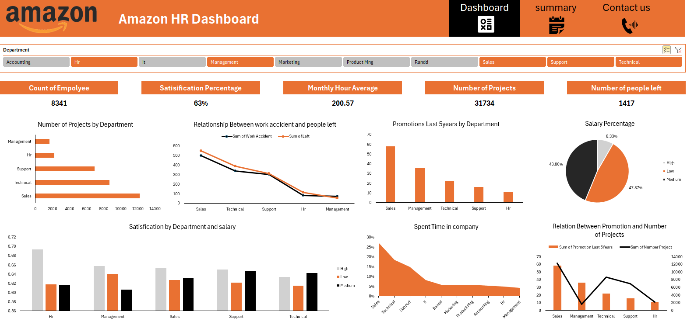
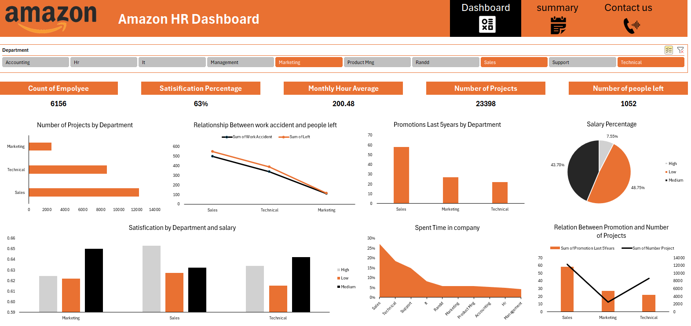
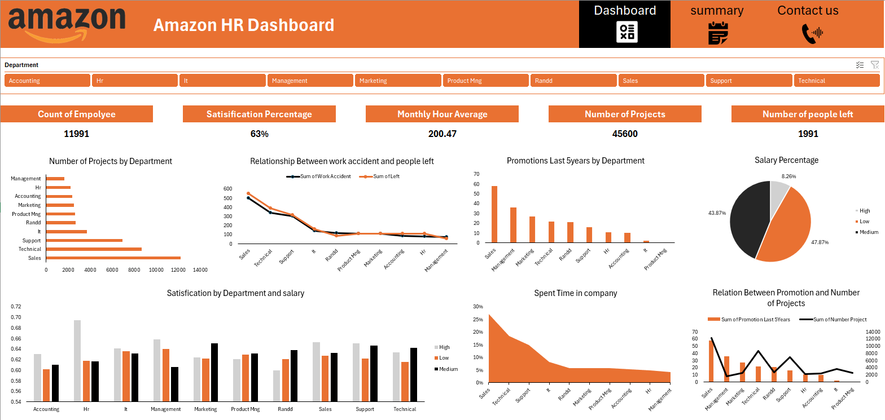

# 🟠 Amazon HR Dashboard — Excel Analytics

> An interactive multi-page HR analytics dashboard built in Microsoft Excel, analyzing employee data across 10 departments at Amazon — covering attrition, satisfaction, salary distribution, promotions, and workforce insights.

---

## 📌 Project Overview

This project transforms raw HR data into a fully interactive Excel dashboard that helps HR teams and management understand workforce dynamics, identify retention risks, and make data-driven decisions.

| Detail | Info |
|---|---|
| **Tool** | Microsoft Excel |
| **Dataset** | Amazon HR Data (11,991 employees) |
| **Departments** | 10 (Sales, Technical, Support, HR, IT, Marketing, and more) |
| **Pages** | Dashboard · Summary · Contact |

---

## 📊 Dashboard Screenshots

### Full Overview — All Departments

Complete HR picture across all departments: **11,991 employees**, **63% satisfaction rate**, **200.47 avg monthly hours**, **45,600 total projects**, and **1,991 employees left**.

---

### Filtered — Marketing & Technical & Sales

Drill-down into selected departments: **6,156 employees**, **1,052 people left**. Sales leads in both project count and promotions over the last 5 years.

---

### Filtered — Single Department View

Department-level analysis showing satisfaction by salary band, work accident correlation with attrition, and promotion trends.

---

## 💡 Key Insights

- 👥 **Total Employees: 11,991** across 10 departments
- 📉 **Attrition Rate: ~16.6%** — 1,991 employees left
- 😊 **Satisfaction Rate: 63%** consistent across all departments
- ⏱️ **Avg Monthly Hours: 200.47** — indicating high workload
- 🏆 **Sales** leads in project count (12,000+) and promotions in the last 5 years
- 💰 **Salary Distribution:** Low 47.87% · Medium 43.87% · High 8.26%
- ⚠️ **Strong correlation** between work accidents and employee turnover in Sales & Technical
- 📅 **25%+ of employees** spent 2–3 years before leaving — a key retention window

---

## 🛠️ Tools & Techniques

- **Microsoft Excel** — PivotTables, PivotCharts, Slicers, Navigation Buttons
- **Data Cleaning** — Fixed errors, removed duplicates, handled missing values
- **Multi-page Layout** — Dashboard · Summary · Contact pages
- **Interactive Filters** — Department slicer affecting all visuals simultaneously
- **Visualizations** — Bar charts, Line charts, Pie chart, Combo chart, Waterfall

---

## 📁 Files in This Repo

| File | Description |
|---|---|
| `Amazon_HR.xlsx` | Raw dataset + full interactive dashboard |
| `1.png` | Full dashboard — all departments |
| `2.png` | Filtered — all departments selected |
| `3.png` | Filtered — Marketing, Technical & Sales |

---

## 🚀 How to Use

1. Download `Amazon_HR.xlsx`
2. Open in **Microsoft Excel** (2016 or later recommended)
3. Use the **Department slicer** at the top to filter by department
4. Navigate between pages using the **Dashboard / Summary / Contact** buttons
5. All KPIs and charts update dynamically

---

## 👤 Author

**Belal Farrag** — Data Analyst

